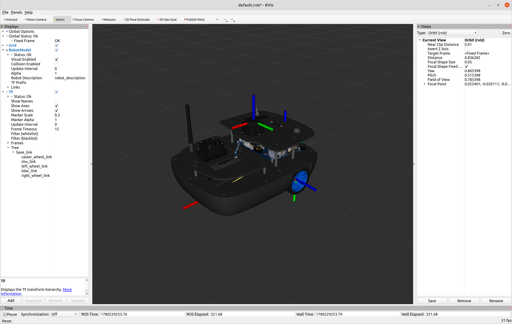
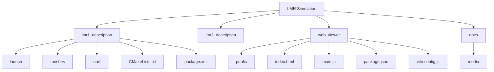

<div align="justify">

# LENNA Mobile Robot Simulation

<p align="center">
  
</p>

<p align="center">
  <a href="https://lenna-robotics-research-lab.github.io/LMR1-Simulation/">
    
  </a>
</p>

LMR1 is a differential-drive mobile robot platform intended for research and education. The repository maintains equivalent ROS1 and ROS2 implementations to support both legacy and modern robotics workflows.

> [!NOTE]\
> Use the `Interactive URDF Viewer` to spawn the URDF online. Please note that it might take several seconds to fully bring up the LMR1 robot model.

## Repository Structure



## ROS Implementations

<table>
<tr>
<td width="50%" valign="top">

### ROS1 (Noetic)

The ROS1 version provides a complete simulation environment for the LMR1 platform using the ROS Noetic/Melodic ecosystem.

#### Features

- Differential-drive mobile robot
- URDF/Xacro robot description
- Gazebo simulation
- RViz visualization
- SLAM Toolbox integration
- AMCL localization
- Navigation Stack support

#### Quick Start

Copy the `lmr1_description` package from this repository into your ROS workspace and build the package.

```bash
$ catkin build lmr1_description
$ source devel/setup.bash
```

##### RViz Display

To visualize the LMR1 URDF model in RViz, use the `display.launch` file:

```bash
$ roslaunch lmr1_description display.launch
```

##### Gazebo Simulation Turtlebot World

To spawn the LMR1 robot in Gazebo using the default TurtleBot world, launch `gazebo.launch`:

```bash
$ roslaunch lmr1_description gazebo.launch
```

##### GMapping SLAM Implementation

You can run `gmapping_slam.launch` to demonstrate the GMapping SLAM algorithm using the LMR1 robot within the TurtleBot world environment.

<p align="center">
  
</p>


```bash
$ roslaunch lmr1_description gmapping_slam.launch
```

</td>
<td width="50%" valign="top">

### ROS2 (Humble)

> [!NOTE]\
> UNDER DEVEVLOPMENT!

</td>
</tr>
</table>


## License

Specify your license here.


</div>