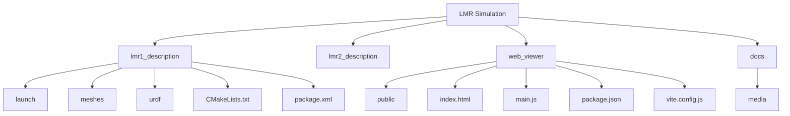

# LENNA Mobile Robot Simulation

<p align="center">
  
</p>

<p align="center">
  <a href="https://lenna-robotics-research-lab.github.io/LMR1-Simulation/">
    
  </a>
</p>

## Robot Overview

LMR1 is a differential-drive mobile robot platform intended for research and education in:

- Autonomous navigation
- Mapping and localization
- Robot intelligence
- Decision making
- Control systems

The repository maintains equivalent ROS1 and ROS2 implementations to support both legacy and modern robotics workflows.

## Repository Structure




<table>
<tr>
<td width="50%" valign="top">

### ROS1 (Noetic)

The ROS1 version provides a complete simulation environment for the LMR1 platform using the ROS Noetic/Melodic ecosystem.

#### Features

- Differential-drive mobile robot
- URDF/Xacro robot description
- Gazebo simulation
- RViz visualization
- SLAM Toolbox integration
- AMCL localization
- Navigation Stack support

#### Quick Start

```bash
catkin_make
source devel/setup.bash
roslaunch lmr1_gazebo simulation.launch
```

</td>
<td width="50%" valign="top">

### ROS2 (Humble)

The ROS2 version provides a modern simulation environment built on the ROS2 ecosystem and contemporary robotics workflows.

#### Quick Start

```bash
colcon build
source install/setup.bash
ros2 launch lmr1_gazebo simulation.launch.py
```

</td>
</tr>
</table>


## License

Specify your license here.